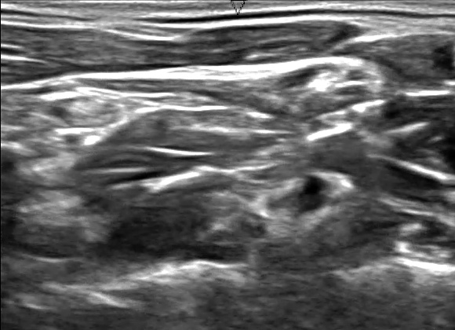
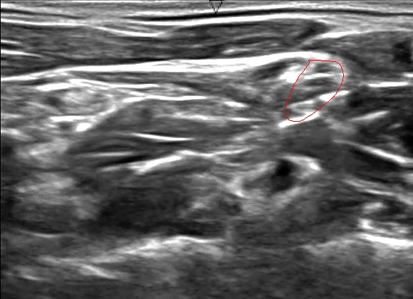

```{r setup, include=FALSE}
knitr::opts_chunk$set(echo = TRUE)
```

## Background

This is an illustration of how to manipulate TIFF images in R. The inspiration came from this tutorial for [python](https://www.kaggle.com/chefele/ultrasound-nerve-segmentation/animated-images-with-outlined-nerve-area/code). The result of the below described steps is the combination of two images into one:





## Step 1: Read in ultrasound and corresponding mask images

I used the [EBImage](http://earlglynn.github.io/RNotes/package/EBImage/Intro-to-EBImage.html) package to read and manipulate the tiff images.

```{r}
library(EBImage)

## read tiff files
filepath <- "train/1_1.tif"
filepath.m <- "train/1_1_mask.tif"
Image <- readImage(filepath)
Mask <- readImage(filepath.m)
```

Let's have a look at the ultrasound image:

```{r}
display(Image)
```

The images are read into objects of class 'Image'. The pixel data is saved into a matrix called '.Data'.


```{r}
str(Image)
```

## Step 2: Add red overlay to ultrasound image

In order to create the red overlay to the ultrasound image, the image first has to be transformed to a color (RGB) file. After that the 'paintObjects' in combination with the mask image will magically create an outline.

```{r}
## Add masked line to original image
Image_color <- toRGB(Image)
Image_color <- paintObjects(Mask, Image_color, col='red')
display(Image_color)
```